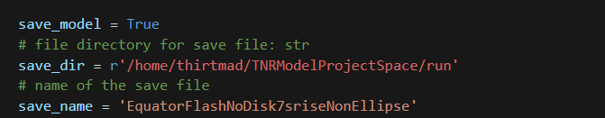

# TNRModelling

This software models thermonuclear flashes on the surface of neutron stars, simulating how light curves generated by various parametrically defined flow patterns would appear to an observer. The model currently includes a stable implementation of uniform spreading thermonuclear (TNR) flows, with an experimental feature outlined in the "Experimental Features" section. Light curves are computed for different combinations of observer angles and flash start points, relative to the neutron star's rotation axis.

Additionally, the model incorporates a representation of the accretion disk surrounding the neutron star, enabling the calculation of light curves that account for photon obstruction by the disk.

The primary goal of this model is to provide a computational environment where the effects of various flow patterns and accretion disk configurations on light curves during thermonuclear flashes can be explored.

## Requirements

To run the model the user needs to have NumPy, MatplotLib, SciPy, Numba and Pandas installed in their environment. Currently Numba relies on a numpy version >= 1.26.3 & < 1.27. The model works with:
- python                    3.12.7
-  numba                     0.60.0
-  matplotlib                3.9.2
-  numpy                     1.26.4
-  scipy                     1.13.1
-  pandas                    2.2.2

## Model Overview

The Repo includes the package TNRModelling which contains all the files and functions for performing simulations and some basic analysis on the generated light curves. In the repo there is also a RunModel.ipynb notebook which contains 3 cells. One to setup all the parameters for a simulation, one to run the whole simulation with the given parameters, and one to perform a basic visualisation of all the light curves generated by the model.

A simulation can be run by changing the values in the top cell of the notebook, then running all the cells.

The model is implemented in the form of a package that can be used in code to fit together aspects of modelling a light curve but includes the run model jupyter notebook for a less experienced coder to be able to run basic simulations.

## Parameters
I am going to reference the neutron star rotation axis as NSRA through this section. The images are taken from an arbitrary example and can all be changed by the user.

The model can be saved by setting the parameter save model to True and specifying a file path and a filename for the save file. The Saving is to CSV format and uses Pandas to_csv(). The light curves are saved with row indexes corresponding to the observer angle and the flash start angle wrt the neutron star rotation axis. The columns correspond to timesteps in the simulation and each entry is a _flux_ (the flux is arbitrary units) measurement.

The next set of parameters setup the neutron star rotation frequency, the time resolution, the range of observer angles wrt the NSRA, the range of flash starting angles wrt the NSRA and the number of points to test within each of those ranges. Both the flash and the observer are set to start $\frac{\pi}{2}$ $radians$ from the NSRA. The range of observer angles and flash angles are in units of $\pi$ $radians$. The maximum observer range is $-0.5<= \theta <= 0.5$. The maximum flash range is $0<= \theta <= 1$.

These two parameters are to define the expected rise time and cool time of the burst. Most likely this would correspond to an average rise time of the light curves that are being investigated in the data.

The last set of parameters are for including a pseudo accretion disk into the model. The current implementation of the accretion disk is a toroidal shape that has a cross section that looks like an ellipse and is a surface revloution about an axis. The model calculations allow the use of an arbitrary accretion disk shape. This would require the user to code their own implementation and use the code as a library to run simulations on their own defined disk. The accretion disk is set to block all photons that _hit_ the accretion disk.

- The first parameter sets whether to include an accretion disk in the model
- The second defines the number of points that are used to create the disk cross section
- The third defines the number of angles around the surface of revolution to generate a cross section loop
- The fourth determines the tilt angle of the accretion disk this allows manipulation of off equator accretion disks if the user requires
- The fifth defines the inner radius of the accretion disk in units of neutron star radius.
  - A setting of 1 is an accretion disk just touching the neutron star and values should be in the open range 1 < inner radius
- The sixth defines the radius of the disk in units of neutron star radius and is the distance from the innr radius to the ourter radius of the disk
- The seventh defines the maximum width of the cross section of the disk in units of neutron star radius*
- The eighth defines where around the disk the observer is facing the disk*
- the ninth is the number of regions used to approximate the concave hull of the accretion disk projections.
  - A projection of an accretion disk forms a concave hull. Algorithms do not exist to completely identify a concave hull and approximations are used. Due to the rotational nature of the accretion disk the projection plane is subdivided into angular regions and the convex hull of each region is computed. The overall concave hull is then approximated by fitting together the convex hull of each region.

## Experimental Features

The model has a different flow type implemented which approximates an elliptic flow across the surface of the neutron star. This flow is fully functioning in terms of the claculations however due to the elliptical nature the rise time varies according to the ratio of the equitorial and polar velocities of the flow regime. Work is ongoing to align the rise time parameter in the run model jupyter notebook. Currently, this rise time will not give the correct time when the sphere is fully covered by the flow.

The elliptical spread approximation class can be found in the SpreadClasses.py file and is the RectSliceSpread class. A document containing a full mathematical explanation of the model will be uploaded soon.

## Known bugs

There is a bug in the accretion disk modelling. The specific error is a Qhull error from the SciPy convex hull algorithm. The bug occurs when the observer is aligned to the accretion disk radial axis and the projection regions only contain one set of generated loop points which in the projection plane form a line. The bug is specifically that the algorithm cannot find a 2D shape in that region (as the points form a line). Work is ongoing to completely erradicate this error. One known workaround is to set the observer azimuthal parameter to a small value $~1e-5$ such that the disk get's minimally shifted and the lines then become slight oval shapes that the program can pickup. Further, using a finer accretion disk mesh with a smaller number of projection regions can remove the bug.

This Was fixed in a later version of the program. By introducing a dispersion term to the accretion disk generation which randomly disperses points around the accretion disk by a uniform distribution of the angular distance between two slices of the disk. This would not work in future versions if the accretion disk is non uniform. Although with a parametric accretion disk one could disperse the points along contours of the accretion disk.

